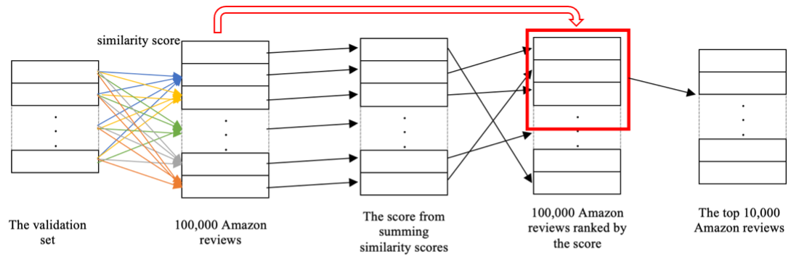
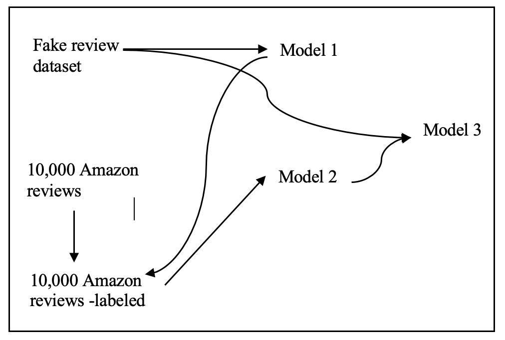

# <a href="https://drive.google.com/drive/u/0/folders/1GvHMPye_TPYTGTCafHhL_uL1XA0wUcR-">Deep Learning to Detect Computer-Generated Reviews in E-Commerce</a>
This project addresses the pervasive issue of fraudulent reviews in online shopping platforms, which undermine consumer trust and hinder informed decision-making. Leveraging advanced deep learning techniques and utilizing the BERT model from the Hugging Face Transformers library, we aim to discern between genuine human-authored reviews and computer-generated ones. By employing PyTorch for model development and evaluation, we seek to enhance the reliability of online product reviews, ultimately contributing to the creation of more resilient and trustworthy e-commerce platforms. Our goal is to empower consumers with the ability to distinguish between authentic and fake reviews, thereby fostering confidence and integrity in the digital marketplace. 
## Table of Contents
- [Features](#features)
- [Models](#models)
- [Installation](#installation)
- [Prediction](#prediction)

## Features
- Detects fraudulent reviews using advanced sentiment analysis.
- Utilizes pre-trained BERT model for robust language comprehension.
- Employs deep learning techniques for model training and evaluation.
- Enhances consumer ability to identify authentic reviews.
- Provides comprehensive performance metrics for model assessment.

## Models
### Model Architecture
The core of our approach is based on a modified version of the BERT architecture from the Hugging Face Transformers library, specifically the AutoModelForSequenceClassification on <a href="https://huggingface.co/google-bert/bert-base-uncased">'bert-base-uncased'</a>.

The model comprises around 110 million parameters and is a bidirectional transformer pre-trained using masked language modeling and next sentence prediction on a large corpus, including the Toronto Book Corpus and Wikipedia.

The primary focus of this project revolves around the masked language modeling objective.

[BERT Model Architecture](images/)
<p align="center"></p>

### Training Phase
1. **Dataset Preparation**: The model is trained on <a href="https://osf.io/tyue9/">a diverse labeled dataset</a> encompassing both genuine and computer-generated reviews.
2. **Supervised Learning**: Through supervised learning, the model hones its understanding of semantic analytics and patterns inherent to authentic human sentiments.
4. **Fine-Tuning**: Iterative parameter adjustments further enhance the model’s discernment capabilities - Model 1.

### Dataset Creation
- **Embedding Reviews**: Reviews are embedded into a 768-dimensional dense vector space using the Sentence-Transformers library on <a href="https://huggingface.co/sentence-transformers/all-mpnet-base-v2">'sentence-transformers/all-mpnet-base-v2'</a>.
- **Cosine Similarity-Based Selection**:  <a href="https://github.com/hanchau94/Fake-Reviews-Detection/blob/main/Dataset/Model_2_dataset.csv"> The new dataset</a> is created by selecting 10,000 reviews from the Amazon review dataset based on cosine similarity to the validation set.
  <p align="center"></p>

### Model Stacking
- **Model 2 to Model 3 Transition**: The pre-trained Model 2 acts as a starting point for Model 3, leveraging the knowledge and features learned during previous training.
- **Feature Extraction**: Model 2 serves as a feature extractor, capturing relevant information from the Amazon dataset, which is then fine-tuned on the original dataset to improve performance.
- **Majority Voting Ensemble**: Final predictions for Model 4 are generated by assigning the label with the majority of votes from all trained models.

  <p align="center"></p>

### Testing Phase
- **Rigorous Evaluation**: The model is evaluated on a separate set of reviews, including a significant proportion of computer-generated content.
- **Performance Metrics**: Precision, recall, and F1 score are used to assess the model’s effectiveness in accurately classifying reviews.

## Installation
Install the following required libraries:
- PyTorch ([guide](https://pytorch.org/get-started/locally/))
- transformers ([guide](https://huggingface.co/docs/transformers/installation))
- Sentence Transformers ([guide](https://huggingface.co/sentence-transformers))
- pandas, scikit-learn, and re

## Prediction

To predict and detect whether a review is genuine or computer-generated, you need to download and use the following models: <a href="https://drive-google-com.translate.goog/drive/folders/1GvHMPye_TPYTGTCafHhL_uL1XA0wUcR-?_x_tr_sl=en&_x_tr_tl=vi&_x_tr_hl=vi&_x_tr_pto=wapp&_x_tr_hist=true">Model 1</a> and <a href="https://drive-google-com.translate.goog/drive/folders/1GvHMPye_TPYTGTCafHhL_uL1XA0wUcR-?_x_tr_sl=en&_x_tr_tl=vi&_x_tr_hl=vi&_x_tr_pto=wapp&_x_tr_hist=true"> Model 3</a>.

- Model Download: Ensure you have downloaded both Model 1 and Model 3 before proceeding.
- Prediction Scripts: Use ```predict-Model3.py``` or ```predict-Model4.py```to extract and analyze concepts from a review text. These scripts will process the sequence of words and generate predictions based on the trained models.


